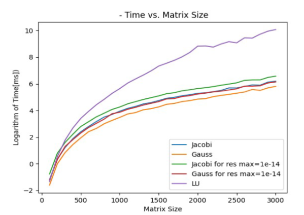

# Numerical Methods for Solving Linear Systems

## Overview
This project implements and compares various numerical methods for solving large systems of linear equations, including:

- **Jacobi Iterative Method**
- **Gauss-Seidel Iterative Method**
- **LU Decomposition (Direct Method)**

It evaluates the performance and accuracy of these methods on different problem sizes using execution time and residual norm analysis.

## Features
- **Matrix and Vector Initialization:** Dynamically generates system matrix `A` and vector `b`.
- **Iterative and Direct Solvers:** Implements Jacobi, Gauss-Seidel, and LU decomposition.
- **Performance Analysis:** Tracks execution times and convergence rates.
- **Scalability Testing:** Runs solvers on various matrix sizes (N = 100 to 3100).
- **Visualization:** Uses `matplotlibcpp` for plotting residual norms and execution times.

## Dependencies
Ensure you have the following libraries installed:

```sh
sudo apt-get install libblas-dev liblapack-dev
```

For `matplotlibcpp`, clone and include the header:
```sh
git clone https://github.com/lava/matplotlib-cpp.git
```

## Compilation & Execution
Use a C++ compiler like `g++`:
```sh
g++ -std=c++11 main.cpp -o solver -I./matplotlibcpp -llapack -lblas
./solver
```

## Code Structure
```
??? main.cpp                     # Main execution file
??? jacobi.h                      # Jacobi method implementation
??? gauss_seidel.h                # Gauss-Seidel method implementation
??? lu_decomposition.h            # LU decomposition method
??? matrix_vector_initialization.h # Matrix and vector setup
??? plotting.h                    # Visualization using matplotlibcpp
??? matplotlibcpp.h               # Matplotlib C++ wrapper
??? README.md                     # Project documentation
```

## Results
The program plots:
1. **Residual Norms:** Convergence analysis for Jacobi and Gauss-Seidel.
2. **Execution Time vs Matrix Size:** Performance of all methods.
3. **Logarithmic Execution Time:** Trend analysis of computational complexity.

## Example Output



## Author
Wiktor Wojtyna
